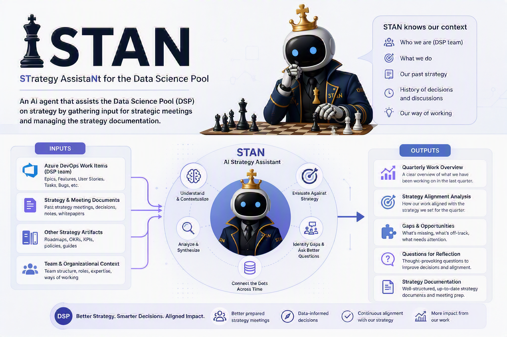

# Stan
Strategy Assistant for the Data Science Pool.

## What it is

The Data Science Pool is a team of data scientists and engineers that support the Microsoft Security business. The team has quarterly strategy sessions to plan and prioritize work for the next quarter. Stan is an AI agent that helps the team prepare for these sessions by providing input based on data in Azure DevOps, and it also helps summarize and incorporate the outputs of the sessions into a knowledge base for future reference.

## Primary use cases

1. Ask Stan to provide input for a quarterly strategy session based on data in Azure DevOps.
2. Ask Stan to summarize and incorporate the outputs of a quarterly strategy session into the strategy knowledge base.

## What’s in this repo

- Strategy playbook: [docs/strategy-playbook.md](docs/strategy-playbook.md)
- Spec Kit setup: [docs/spec-kit-setup.md](docs/spec-kit-setup.md)
- Stan agent docs: [docs/stan-agent/index.md](docs/stan-agent/index.md)
- Specs: [001 — Stan Chat Agent](specs/001-stan-chat-agent/spec.md), [002 — Read DevOps Wiki](specs/002-read-devops-wiki/spec.md), [003 — MCP Wiki Access](specs/003-mcp-wiki-access/spec.md)
- Agent config: [.github/copilot-instructions.md](.github/copilot-instructions.md), [AGENTS.md](AGENTS.md)

## Setup / Quick Start

To set up Stan for first use (requirements, MCP configuration, startup, and verification), follow:

- [STAN-QUICKSTART.md](STAN-QUICKSTART.md)

Additional runtime details:

- [docs/stan-agent/devops-access.md](docs/stan-agent/devops-access.md)
- [specs/003-mcp-wiki-access/contracts/wiki-read-contract.md](specs/003-mcp-wiki-access/contracts/wiki-read-contract.md)

## Stan Agent Docs

- Overview: [docs/stan-agent/index.md](docs/stan-agent/index.md)
- Quarterly structure reference: [docs/stan-agent/quarterly-structure.md](docs/stan-agent/quarterly-structure.md)
- Scope boundaries: [docs/stan-agent/scope-boundaries.md](docs/stan-agent/scope-boundaries.md)
- Deliverable format: [docs/stan-agent/deliverable-format.md](docs/stan-agent/deliverable-format.md)
- Response templates: [docs/stan-agent/response-templates.md](docs/stan-agent/response-templates.md)
- DevOps wiki access: [docs/stan-agent/devops-access.md](docs/stan-agent/devops-access.md)